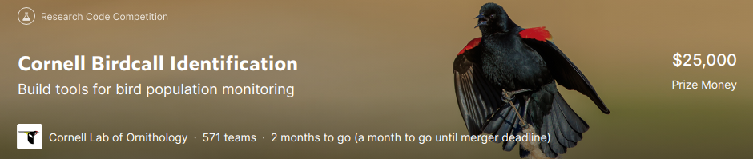
# kaggle-Cornell-Birdcall-Identification
Cornell Birdcall Identification コンペのリポジトリ

- result
  - public: 0.566
  - private: 0.599
  - rank: 114/1390

    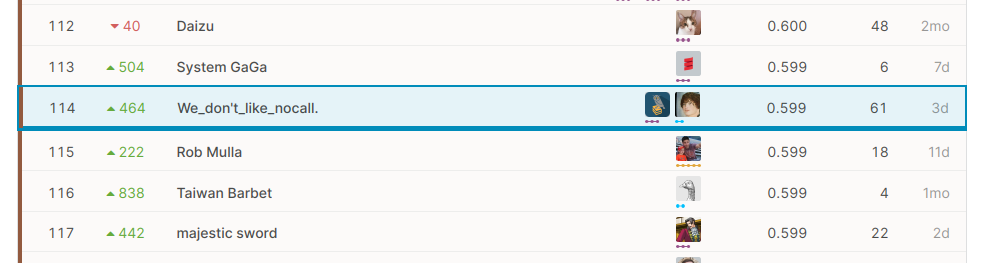


- directory tree
```
Kaggle-Cornell-Birdcall-Identification
├── README.md
├── data         <---- gitで管理するデータ
├── data_ignore  <---- .gitignoreに記述されているディレクトリ(モデルとか、特徴量とか、データセットとか)
├── nb           <---- jupyter lab で作業したノートブック
├── nb_download  <---- ダウンロードした公開されているkagglenb
└── src          <---- .ipynb 以外のコード

```

## Pipeline
- 実行例
  ```bash
  python3 pipeline.py --globals.balanced=1 --globals.comment=test
  ```

- 結果の表示例
  ```bash
  python3 show_result.py -d 0
  ```


## Info
- [issue board](https://github.com/fkubota/kaggle-Cornell-Birdcall-Identification/projects/1)   <---- これ大事だよ
- [google slide](https://docs.google.com/presentation/d/1ZcCSnXj2QoOmuIkcA-txJOuAlkLv4rSlS7_zDj90q6c/edit#slide=id.p)
- [flow chart](https://app.diagrams.net/#G1699QH9hrlRznMikAEAE2-3WTjreYcWck)
- [google drive](https://drive.google.com/drive/u/1/folders/1UDVIKTN1O7hTL9JYzt7ui3mNy_b6RHCV)
- ref:
  - [metricについて](https://www.kaggle.com/shonenkov/competition-metrics)
- docker run 時にいれるオプション
  - `--shm-size=5G`

## Timeline

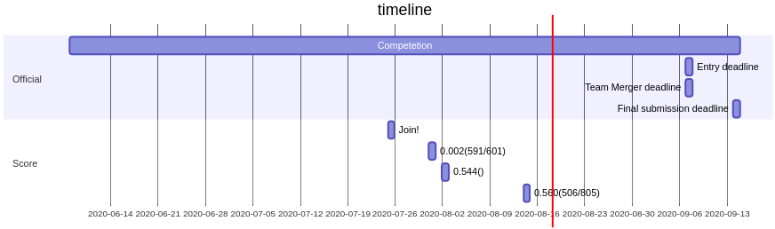

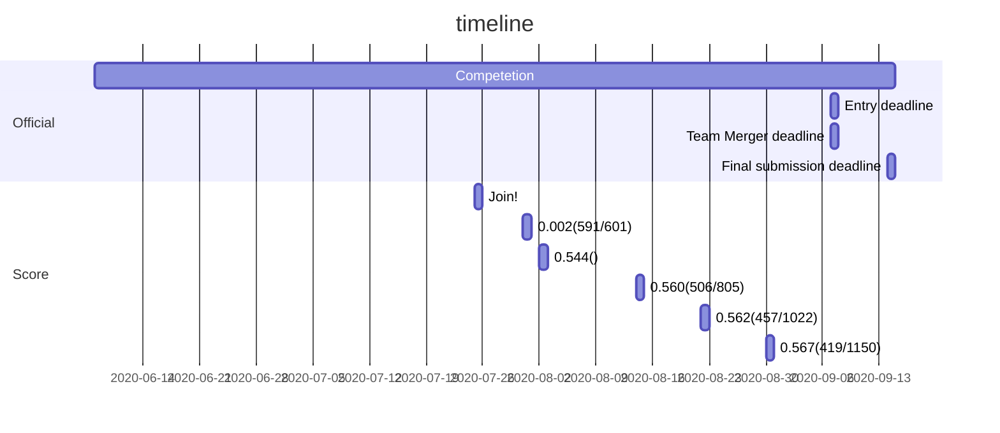
```mermaid
gantt
  title timeline
  dateFormat YYYY-MM-DD
  section Official
  Competetion: a1, 2020-06-08, 2020-09-15
  Entry deadline: a3, 2020-09-07, 2020-09-08
  Team Merger deadline: a4, 2020-09-07, 2020-09-08
  Final submission deadline: a2, 2020-09-14, 2020-09-15

  section Score
  Join!:2020-07-25, 2020-07-26
  0.002(591/601): 2020-07-31, 2020-08-01
  0.544(): 2020-08-02, 2020-08-03
  0.560(506/805): 2020-08-14, 2020-08-15
  0.562(457/1022): 2020-08-22, 2020-08-23
  0.567(419/1150): 2020-08-30, 2020-08-31
```

## Dataset
|Name|Detail|Ref|
|---|---|---|
|SpectrogramDataset|5秒のSpectrogramを取得する。audiofileが5秒より短い場合、足りない部分に0 paddingする。5秒より長いものはランダムに5秒の部分を抽出する。|[公開ノートブック(tawaraさん)](https://www.kaggle.com/ttahara/training-birdsong-baseline-resnest50-fast)|
|SpectrogramEventRmsDataset|(バグ有り)SpectrogramDataset(SD)を改良。SDでは、鳥の鳴き声が入っていない部分を抽出する可能性があったのでそれを回避するために作った。librosa_rmsを使用し、バックグラウンドに比べてrmsが大きい値を取る時evet(birdcall)とした。|nb012|
|SpectrogramEventRmsDatasetV2|SpectrogramEventRmsDatasetにバグがあった(nb015)のでfix。|nb015|
|SpectrogramEventRmsDatasetV3|SpectorgramEventRmsDatasetV2を高速化。(nb017で作ったデータフレームを使用)|nb018|
|SpectrogramEventRmsDatasetV4|1sec 専用Dataset。V3で煩わしかった境界問題に対処した。|nb021|
|PANNsDatasetMod|PANNs用。とはいえSpectrogramDatasetとほとんど同じ。スペクトログラムは計算せずに、signalをPANNsに渡すようになってる。|nb024|
|PANNsDatasetEventRmsDataset|PANNs用。nb017_event_rmsを使用してevent部分で学習している。|nb025|
|SpectrogramEventRandomDataset|nb034のeventデータを使う。event部分だけだと、小さな鳥の鳴き声が学習に入らない可能性があるため、event+random_cropを行なう。ratioパラメータがあり、足すeventの大きさを変えられる。|nb043|

## Event
|Name|Detail|Ref|
|---|---|---|
|nb017_event_rms|liborsaのrmsを使用。ラウドネスを見ていると思えばいい。|nb017|
|nb034_event_intensity_500to16000hz|500~16000HzのスペクトルのIntensityをが大きいところをevent部分としている。|nb034|


## Features
|Name|shape (feat only)|size(MB)|Detail|
|---|---|---|---|
|nb004_librosa_mfcc.csv|(21,375, 11)|2.0|librosaのmfcc(2~12)。audiofile1つにつき1ベクトル。srを揃えてないので周波数空間の大きさに差が有り問題がありそう。srを16kHzとかにそろえたほうがいいと思う。|
|nb007_librosa_mfcc02.csv|(4,779,859, 11)|436.1|nb004の特徴量の拡張。audiofile内のn_feat/m_audio/1_bird。nb004の特徴量よりかなりデータ数が多い。|
|nb008_librosa_basic|(4,779,859, 12)|482.7|['rms', 'centroid', 'sc_1', 'sc_2', 'sc_3', 'sc_4', 'sc_5', 'sc_6', 'sb', 'sf', 'sr', 'zcr']。nb004と同じくsrを揃えていない問題がある。|
|nb010_librosa_rms.csv|(4779859, 3)|144|event部分だけ抽出する際のthresholdとして使う。|

## Paper
|No.|Status|Name|Detail|Date|Url|
|---|---|---|---|---|---|
|01|<font color='gray'>Done</font>|音響イベントと音響シーンの分析|日本語記事。まず最初に読むとよい。|2018|[url](https://www.jstage.jst.go.jp/article/jasj/74/4/74_198/_pdf)|
|02|<font color='green'>Doing</font>|PANNs: Large-Scale Pretrained Audio Neural Networks for Audio Pattern Recognition|アライさんがSEDの説明ノートブックで参照していた論文|201912|[url](https://arxiv.org/abs/1912.10211)|
|03|<font color='gray'>Done</font>|Recognizing Birds from Sound - The 2018 BirdCLEF Baseline System|鳥の鳴き声を検出するコンペ？のベースライン。nocall除去についての方法が書かれていた。さらに、nocall部分をノイズとして加えたaugmentationがかなり効いたみたい。鳴き声は0.5~12kHzに集中するらしい。|201804|[url](https://arxiv.org/abs/1804.07177)|
|04|<font color='orange'>Todo</font>|ResNeSt: Split-Attention Networks|ResNeSTの原論文|202004|[url](https://arxiv.org/abs/2004.08955#:~:text=Our%20network%20preserves%20the%20overall,networks%20with%20similar%20model%20complexities.)|
|05|<font color='gray'>Done</font>|Weakly Labelled AudioSet Tagging with Attention Neural Networks|DCASEについての論文。弱ラベルのタスクについて。|2019|[url](https://arxiv.org/abs/1903.00765)|
|06|<font color='gray'>Done</font>|Robust Audio Event Recognition with 1-Max Pooling Convolutional Neural Networks|音響イベント検知についての論文。1-Max Poolingについて。|201604|[url](https://arxiv.org/abs/1604.06338)|
|07|<font color='gray'>Done</font>|Adaptive pooling operators for weakly labeled sound event detection|弱ラベルの音響イベント検知についての論文。|201804|[url](https://arxiv.org/abs/1804.10070)|
|08|<font color='gray'>Done</font>|Guided Learning Convolution System for DCASE 2019 Task 4|DCASE TASK4(SED)の論文。CNNについて。|201909|[url](https://arxiv.org/abs/1909.06178)|
|09|<font color='gray'>Done</font>|Learning Sound Event Classifiers from Web Audio with Noisy Labels|ノイズが入ったラベルについて。|201901|[url](https://arxiv.org/abs/1901.01189)|
|10|<font color='gray'>Done</font>|SpecAugment: A Simple Data Augmentation Method for Automatic Speech Recognition|SpecAugmentの原論文。|201904|[url](https://arxiv.org/abs/1904.08779)|
|11|<font color='gray'>Done</font>|SPECMIX: A SIMPLE DATA AUGMENTATION AND WARM-UP PIPELINETO LEVERAGE CLEAN AND NOISY SET FOR EFFICIENT AUDIO TAGGING |SpecMixの原論文。SpecAugmentに影響を受けている。|2019|[url](http://dcase.community/documents/challenge2019/technical_reports/DCASE2019_Bouteillon_27_t2.pdf)|
|12|<font color='gray'>Done</font>|Large-ScaleBird SoundClassificationusing Convolutional Neural Networks|鳥の鳴き声をDLで検知する論文。nocall部分を除去する方法が知りたくて読む。|2017|[url](http://ceur-ws.org/Vol-1866/paper_143.pdf)|
|13|<font color='gray'>Done</font>|Audio Based Bird Species Identification usingDeep Learning Techniques|鳥の鳴き声をDLで検知する論文。テクニックがいろいろ載ってるっぽい。nocall部分を除去する方法が知りたくて読む。|2016|[url](http://ceur-ws.org/Vol-1866/paper_143.pdf)|
|14|<font color='gray'>Done</font>|GENERAL-PURPOSE TAGGING OF FREESOUND AUDIO WITH AUDIOSET LABELS:TASK DESCRIPTION, DATASET, AND BASELINE|freesound audio tagging compのベースライン論文。とくに有用な情報はなかった。|2018|[url](https://arxiv.org/abs/1807.09902)|
|15|<font color='orange'>Todo</font>|[DL輪読会] Residual Attention Network for Image Classification|日本語のスライド。Resnet+Attensionについて|201709|[url](https://www.slideshare.net/DeepLearningJP2016/dl-residual-attention-network-for-image-classification)|


## Freesound Audio Tagging 2019
|Status|Name|Detail|Date|Url|
|---|---|---|---|---|
|<font color='gray'>Done</font>|Freesound 7th place solution|アライさんたちのチームの解法。Strength Adaptive CropとCustom CNNが良さそう。|2019|[url](https://www.kaggle.com/hidehisaarai1213/freesound-7th-place-solution)|
|<font color='gray'>Done</font>|kaggle Freesound Audio Tagging 2019 4th place solution|freesound audio tagging 2019 4th solution。日本語資料。オレの誕生日に発表してるから良い資料のはず。signal base, image base 両方取り入れている。|20190713|[url](https://www.slideshare.net/ssuser20fb43/kaggle-freesound-audio-tagging-2019-4th-place-solution-156063956)|


## Memo
- term
  - nb: ノートブック
  - kagglenb: kaggleのサイトで見れる/作れるノートブック
- public LBの54%がnocallらしい。(https://www.kaggle.com/c/birdsong-recognition/discussion/159492)

## Basics
**Overview(DeepL)**

窓の外で鳥のさえずりが聞こえてきませんか？世界には1万種以上の鳥が生息しており、手つかずの熱帯雨林から郊外、さらには都市部まで、ほぼすべての環境に生息しています。鳥は自然の中で重要な役割を果たしています。鳥は食物連鎖の上位に位置し、下層で発生している変化を統合します。そのため、鳥は生息地の質の低下や環境汚染の指標として優れています。しかし、鳥は目で見るよりも耳で聞く方が簡単なことが多い。適切な音の検出と分類があれば、研究者は鳥の個体数の変化に基づいて、その地域の生活の質に関する要因を自動的に直感的に把握することができます。

自然の音風景を長期間にわたって連続的に記録することで、鳥類を広範囲に監視するプロジェクトがすでに多く進行中である。しかし、多くの生物や非生物はノイズを発生させるため、これらのデータセットの分析は、多くの場合、専門家が手作業で行っています。このような分析は非常に時間がかかり、結果も不完全なものになりがちです。データサイエンスが助けになるかもしれないので、研究者たちはAIモデルを訓練するために、鳥類の集音録音の大規模なクラウドソースのデータベースに目を向けている。しかし残念なことに、トレーニングデータ（個々の鳥の短い録音）と、モニタリングアプリケーションで使用されるサウンドスケープ録音（複数の種が同時に鳴いていることが多い長い録音）の間には、領域的なミスマッチがあります。これが、現在使用されているAIモデルの性能が低い理由の一つです。

これらの広範で情報量の多いサウンドアーカイブの可能性を最大限に引き出すためには、研究者は、データ駆動型の保存を支援するために、可能な限り多くの情報を確実に抽出する優れた機械リスナーが必要です。

コーネル大学鳥類学研究所の保全生物音響センター（CCB）の使命は、自然界の音を収集し、解釈することです。CCB は革新的な保全技術を開発し、世界中の野生生物や生息地の保全に貢献しています。CCBはデータサイエンスのコミュニティと協力して、その使命をさらに高め、サウンドスケープ分析の精度を向上させたいと考えています。

このコンテストでは、サウンドスケープの録音物に含まれる多種多様な鳥の発声を特定します。録音が複雑なため、ラベルが弱いものが含まれています。人為的な音（例：飛行機の空飛ぶ音）やその他の鳥や非鳥の鳴き声（例：シマリスの鳴き声）が背景にあり、ラベル付けされた特定の鳥の種が前景にあるかもしれません。複雑なサウンドスケープの録音を分析するための効果的な検出器と分類器を構築するために、あなたの新しいアイデアを持ってきてください!

成功すれば、あなたの研究は、研究者が生息地の質の変化、汚染のレベル、修復作業の効果をよりよく理解するのに役立ちます。信頼性の高い機械リスナーはまた、保全活動家が世界中でより多くの録音ユニットを展開することを可能にし、まだ不可能な規模でのデータ駆動型の保全を可能にします。最終的な保全の成果は、鳥類や人間を含む多くの生物の生活の質を大きく向上させる可能性があります。

**data(deepL)**   
隠されたtest_audioディレクトリには、MP3形式の約150の録音が含まれています。これらの録音はノートパソコンのメモリには同時に収まりません。録音は北米の3つの離れた場所で行われました。サイト1と2は5秒単位でラベル付けされており、予測値と一致する必要がありますが、ラベル付けプロセスに時間がかかるため、サイト3のファイルはファイルレベルでのみラベル付けされています。そのため、サイト3はテストセットの行数が比較的少なく、より低い時間分解能の予測が必要です。 別のデータソースからの2つのサウンドスケープの例も、サウンドスケープがどのようにラベル付けされているかと、隠しデータセットのフォルダ構造を説明するために提供されています。2つの例の音声ファイルはBLKFR-10-CPL_20190611_093000.pt540.mp3とORANGE-7-CAP_20190606_093000.pt623.mp3です。これらのサウンドスケープは、カリフォルニア科学アカデミー鳥類哺乳類学科のJack Dumbacher氏のご厚意により提供されました。

### train.csv colomn infomaiton
notebook: nb001
example: https://www.xeno-canto.org/134874

|name|Explanation|
|----|----|
|rating|録音の質を表す(A,B,C,D,Eの5段階)|
|playback_sed|...|
|ebird_code|名前。nunique=264|
|channels|チャンネル数。2種類('1 (mono)', '2 (stereo)')|
|date|録音日。yyyy-mm-ddで記述されている。<-- すべてそうなってるかは確認していない。|
|pitch|'Not specified', 'both', 'increasing', 'level', 'decreasing'の5種類。nb001でそれぞれの音を聞いてみた。(log20200730), 正直何を表しているかわからん。|
|duration|audioファイルの再生時間。単位はseconds。|
|filename|そのままの意味。filenameにかぶりはなし(nb001)。|
|speed |Not specified, level, both, accelerating, decelerating の5種類。音を聞いたけど何が違うのか全然わからん。 |
|species|264種類。今回のクラス数と一緒だな。ebird_codeと一対一？|
|number_of_notes|サイト見たけど、何の数かわからん。['Not specified', '1-3', '4-6', '7-20', '>20']の5種類|
|title|\<filename> \<鳥名> ?? の形式で書かれている。|
|secondary_labels|メインの鳥の鳴き声以外のラベル。|
|bird_seen|集音時に鳥を見たかどうか。|
|sci_name|学名？|
|location|集音場所|
|latitude|緯度|
|sampling_late|サンプリングレート|
|type|song, call, fightなどある|
|elevation|標高。'1400 m' みたいな感じで入ってるが、string型。'? m' もある。|
|descriptin|audiofileにかかれているメタデータ。|
|bitrate_o_mp3|stringで'128000 (bps)'のように格納されているが、8個だけNaNになっている(nb001)|
|file_type|4種類。それぞれの個数はmp3=21367, wav=6, mp2=1, aac=1となっている。|
|volume|'Not specified', 'both', 'increasing', 'level', 'decreasing'の5種類。またこの指標出た。意味がわからん。|
|background|背景音。xeno-cantにも記述されている。secondaly_labelsとどう違うのだろうか。|
|xc_id|filenameにある、XCと拡張子を除いた部分。例(XC134874.mp3 の134874がそれに当たる。重複なく各要素はユニーク。)|
|url    |xeno-cant へのリンクURL|
|country|集音した国|
|author|集音者|
|primary_label|ebird_code は primary_labelの略っぽい。例: Empidonax alnorum_Alder Flycatcher	--> aldfly|
|longitude|経度|
|length|'Not specified', '0-3(s)', '6-10(s)', '>10(s)', '3-6(s)' が要素にある。'Not specified' がダントツで多い。|
|time|集音開始時刻。朝が多め。|
|recordist|調べてみたら(nb001)、authorとrecordistは完全に一致してた。|
|license|4種類あった。あまり有用な情報ではないだろう。|


## Log
### 20200726
- join!!
- spectrogram-treeを使って確認してる。
  - フィルタが入ってるデータとか多いな...

| not filter                                                                  | filter                                                                      |
| --------------------------------------------------------------------------- | --------------------------------------------------------------------------- |
| 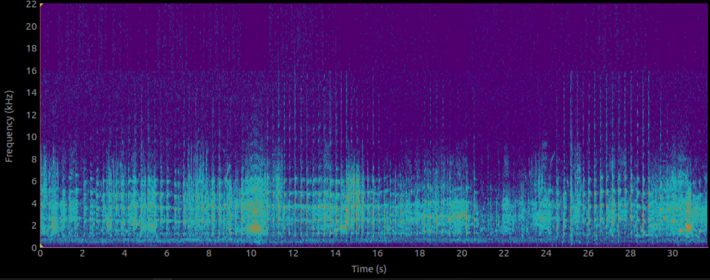 | 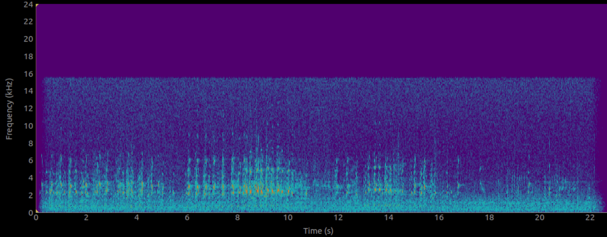 |
| 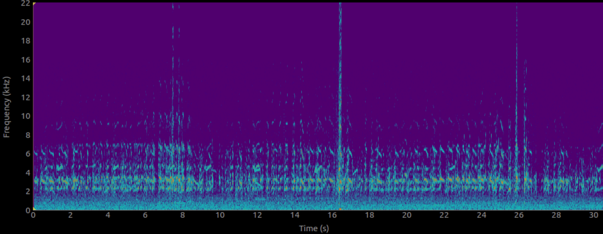 | 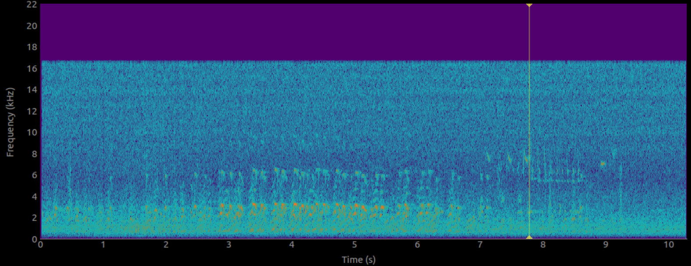 |
|                                                                             |                                                                             |

- なんか音声ファイルにコメントがあったぞ。
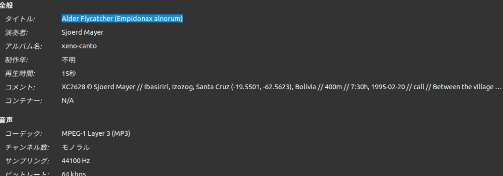
- うーん。とりあえず、提出方法を理解してみよう。

### 20200727
- テストデータはカーネルにしかないのか？
- train.csv
  - nb001
  - train.csvのよくわからないカラムの意味は[ここ](https://www.xeno-canto.org/134874)見ればよさそう。

  | train.csv   | train.csvに記載のurl先  |
  | --- | --- |
  | 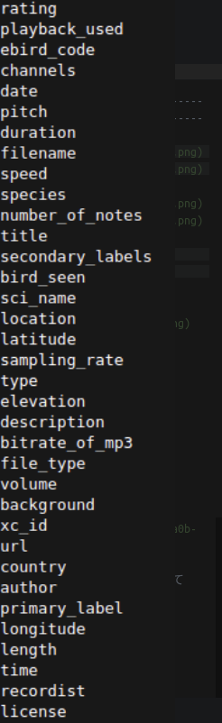    | 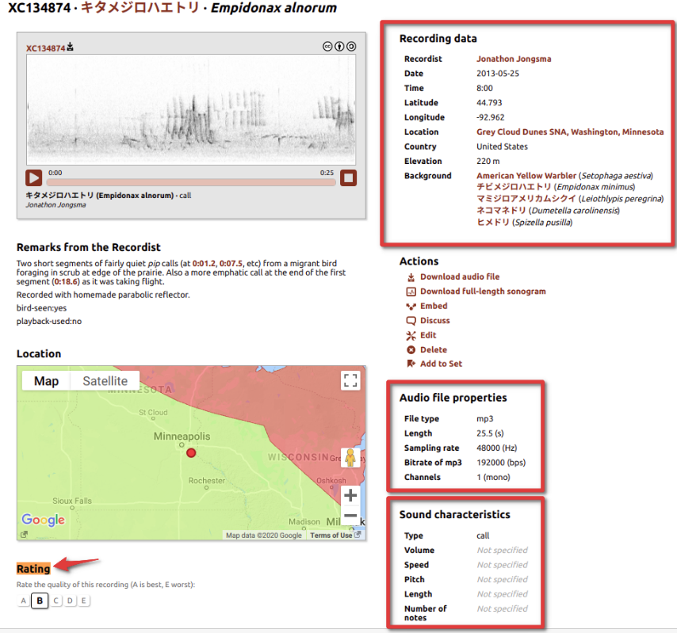  |
  - playback_used と bird_seen のnull数が一致してる。
  - secondary_labelには、メイン(primary_label)以外の鳥の鳴き声などが入ってる...。どうすんのこれ。
  - bird_seen がNoなのは、声は聞いたが見ていないということ。
  - filetypeはわずかだが、mp3以外もあるようだ
  
### 20200729
- discussionにlibroa.load()について投げた
    - https://www.kaggle.com/c/birdsong-recognition/discussion/170749

### 20200730
- xeno-cantoのレーティングの目安
    A: Loud and Clear
    B: Clear, but bird a bit distant, or some interference with other sound sources
    C: Moderately clear, or quite some interference
    D: Faint recording, or much interference
    E: Barely audible

- nb001
    - pitchの、increasing, decreasing, both, level の確認を行った
    - ebird_codeと鳥名の関係がわかった。ebird_codeは鳥名の略。
      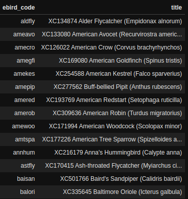


### 20200731
- nb001
  - secondaly_labelsはxeno_cantに情報がなかった。たぶんaudiofileのメタデータから取得したっぽいな。
  - 集音場所をマップに落とすことやってみたかったので、issueにした。
  - secondaly_labelsとbackgroundの違いがよくわからなかったのでissueにした。

### 20200801
- pub-kaggle-nbを見ながらどうやってサブするのかを見た。
  - prv-kaggle-nb でテストデータにアクセスできるが、ここには3つのデータしか開示されない。
  - このサンプルを参考にprv-kaggle-nbを提出する。
  - すると、提出先では完全なテストデータがノートブックに与えられてしっかり評価される。
  - なるほどこういう仕組みか。
  - kaggle-nb でsubする場合は、internet=Off にする必用がある。

- test_audio
  - 10minぐらいのmp3 fileが150個程度ある
  - siteは3つある
    - 1,2は5secごとにラベルがふられている。
    - site 2 は file単位でラベルが振られている。

- このノートブックではチェック用のデータ・セットが配られている。
  - https://www.kaggle.com/shonenkov/sample-submission-using-custom-check
  - submit する前のチェックに使える。

- libros.load() の引数にres_typeというものがある。リサンプルのタイプだ。res_type=’kaiser_fast’で早くすることもできる。

- durationのminに0秒があるな  
  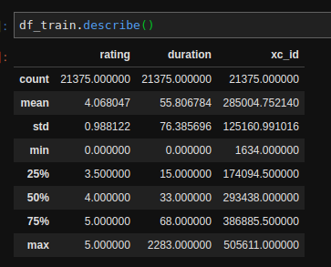

- kagglenb_02_sub
  - first sub
  - このノートブック動かしただけ: https://www.kaggle.com/cwthompson/birdsong-making-a-prediction
  - score
    - cv: xxx
    - sub: 0.002
    - rank: 591/601

- 外部データ・セット(726424_1262046_bundle_archive.zip)をダウンロード
  - url: https://www.kaggle.com/shonenkov/birdcall-check
  - birdcall check と呼ばれてる

- nb004
  - 初めての特徴量を作成した。
  - librosaのmfcc(2~12)。
  - m_feat/m_audiofile/1_ebird
  - 1つのwavからはフレームごとにmfccを得られるがそれを平均化した。

- nb005
  - スペクトログラムを画像で保存するためのコードを書いた。
  - 画像を27000枚ほど作らなければいけなかったのでdpiを小さくした。
  - メモリリークが微妙に防げない...

### 20200802
- nb006
  - nb004 で作成した特徴量を使ってrfcモデルを作成する。
  - モデルを5つ、infoを1つ保存した。
    - info
      - featsets (今回は、nb004_librosa_mfcc.csv)
      - feat_names (↑のfeatsetsから何かを除いたりすることもあると思うので)
    - models (モデルがfold分格納されている)
      - size: 37x5MB

- nb007
  - nb004で作成した特徴量の拡張版
  - n_feat/m_wav/1_bird にした。
  - window_sizeとstrideは0.5, 0.25 sec
  - nb004の特徴量よりデータ数がかなり多い。
    - shape: (4,779,859, 11)
    - time: 2:51:06

### 20200803
- kagglenb_02_nocall_only
  - nocall だけでsubmitしてみた
  - result
    - cv: none
    - sub: 0.544

- このSample Submission File(公式) 見る感じ、複数の鳥が鳴いていればそれを予測するということか。
  - 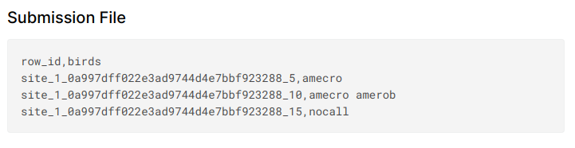

- 今後使いそうなNNの初手
  - https://twitter.com/mlaass1/status/1290131798735781890/retweets/with_comments

- nb008
  - librosaの基本的な特徴量を実装。
  - n_feat/m_wav/1_bird
  - w_size=0.5, w_stride=0.25 sec
  - feats
    - ['librosa_rms', 'librosa_centroid', 'librosa_sc_1', 'librosa_sc_2', 'librosa_sc_3', 'librosa_sc_4', 'librosa_sc_5', 'librosa_sc_6', 'librosa_sb', 'librosa_sf', 'librosa_sr', 'librosa_zcr']


 ### 20200804
  - nb006
    - nb004で作成した特徴量を使ってrfcモデルを作成する。
    - feat: nb004_librosa_mfcc
    - model: rfc
    - cv: 5-fold

  - kagglenb_04_sub
    - nb006のモデルを1つだけ使ってsubしてみた
    - result
      - pub: 0.544 (<---閾値大きすぎて全部nocallだったっぽい)


### 20200805
- timeoutになった場合でもsucseedになる可能性がある？
  - https://www.kaggle.com/c/birdsong-recognition/discussion/172042
  - でもこれ議論がわかれてるな。

- カエル先生のことほんとに見習わないといけない
  - https://www.kaggle.com/c/birdsong-recognition/discussion/169538
  - 2/3にデータにはセカンダリラベルがないが、他の種類の鳥が鳴いていることがある。
    - arai さんの対応方法
      > これまでのところ、私のモデルは潜在的な二次ラベルのためにすべての0を出力するようにしています。私は一次二次ラベルを明確に分離していないので、各サンプルに対して264次元の1ホットベクトルを提供し、一次二次ラベルに対応する位置に1を配置します。サンプルが二次ラベルを持たない場合は、一次ラベルに対応する位置を除いてすべての要素が0であるベクトルを作成します。

  
- カエル先生がそれぞれどのような戦略をとればいいかアドバイスしてくれてる。
  - https://www.kaggle.com/c/birdsong-recognition/discussion/170959#951943

### 20200806
- tawaraさんのリサンプリングデータセットをダウンロードした
  - https://www.kaggle.com/c/birdsong-recognition/discussion/164197
  - size: 72GB
- 今日はディスカッションを眺めるだけで終わってもうた。

### 20200807
- 今日は、pytorchの本でdataloderの勉強とかしてた。
- ノイズ除去を扱ってるノートブック
  - https://www.kaggle.com/takamichitoda/birdcall-noise-reduction
  - noisereduceというライブラリがあるらしい。
- ノイズ除去を扱ってるディスカション
  - https://www.kaggle.com/c/birdsong-recognition/discussion/169582#946072


### 20200809
- tawaraさんのResNestのTrainingノートブックを見てた
  - fold 0 で学習(fold 1to4) で評価というのをやってた。
  - モデル2つで推論とか厳しいのかな...

### 20200810
- mono_to_color は画像ごとに行っているけど大丈夫かな...

- nb009
  - tawaraさんの[trainingノートブック](https://www.kaggle.com/ttahara/training-birdsong-baseline-resnest50-fast?)を理解するためのノートブック
  - ある程度理解できたと思う。
- pytorch でCNNつくってるノートブック(https://www.kaggle.com/radek1/esp-starter-pack-from-training-to-submission)
  - これも参考になる。


### 20200811
- nb010
  - 昨日でてきた疑問(1epoch 12min問題に取り組む)
    - issue: https://github.com/fkubota/kaggle-Cornell-Birdcall-Identification/issues/50
    - kaggle-notebook で動かしてみたけど同じぐらい遅かった。他に原因あり？
    - tawaraさんのノートブックちゃんと見たら学習に8hほどかかっていたことがわかった。
    - 1epochあたり10min前後。
    - こんなもんか。
    - result
      - n_epoch: 50
      - time: 10h 30m
      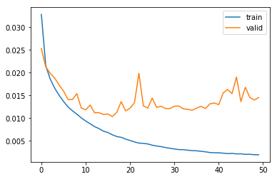


### 20200812
- 評価指標について説明されてる[ディスカッション](https://www.kaggle.com/shonenkov/competition-metrics)
  - サンプル平均？のf1_score?

- かえる先生がvalidationについて言及している[ディスカッション](https://www.kaggle.com/c/birdsong-recognition/discussion/170959#951943)
  - ↑に対しての[アライさんのコメント](https://www.kaggle.com/c/birdsong-recognition/discussion/171247)

- kagglenb05(www.kaggle.com/fkubota/kagglenb05-from-nb010)
  - nb010で作成したモデルを提出してみる
  - version5
    - probaあたりでミスってスコア0.326だった
  - version7
    - version5のミスを修正した
    - スコアは0.490

### 20200813
- nb011
  - bawwar/XC472332.mp3 でエンジン音？のようなものが聞こえた。bawwarのデータが大体そうなのかを確認してみる。
  - 1.3 \* med(librosa_rms) を閾値として、event部分を取り出してみた。結構いい感じ。
      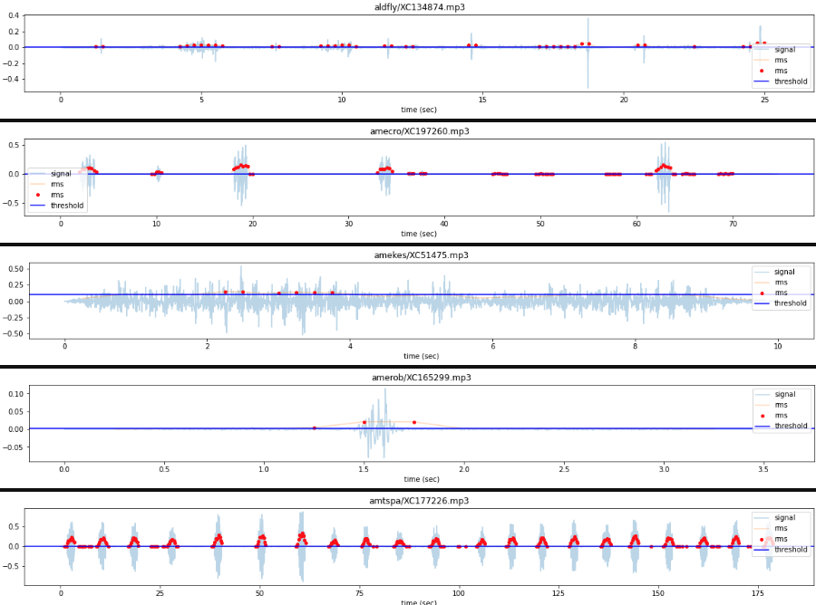

- nb012
  - SpectrogramEventRmsDataset の作成
  - nb011でのevent検出を活かしたデータセット。
  - フロー図
      
  - 実行時間
    - dataset のイテレータ全て実行した場合
      - SpectrogramEventRmsDataset: 14min 28s
      - SpectrogramDataset: 49min 50s

### 20200814
- kagglenb06(https://www.kaggle.com/fkubota/kagglenb06-from-nb010-test-5times-predict?scriptVersionId=40707630)
  - 1秒predictを試してみたいと思っているが、心配なのは、predictの時間が増えること。
  - それを確かめるためにkagglenb05のpredictを5回やってみた。
      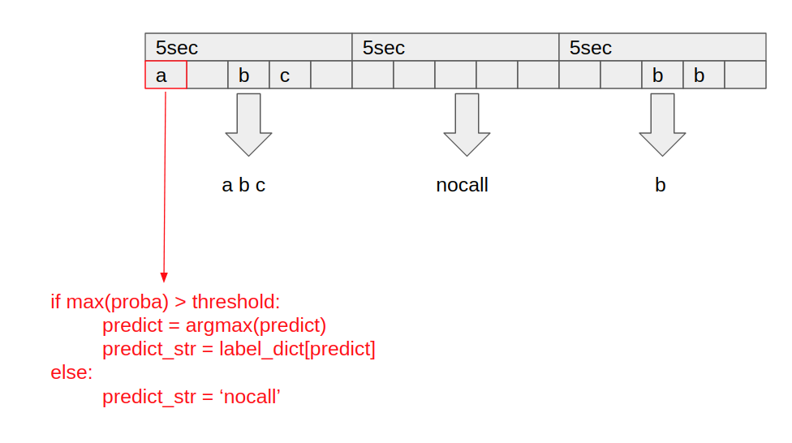
  - result
    - submission通ってた！！
    - これでやってみるか。 

- nb013
  - nb012で作ったデータセット(SpectrogramEventRmsDataset)をつかってresnet18を学習させてみる
  - <font color='red'>悲報</font> : 間違ってブラウザ切ってしまって、ノートブックの更新が止まってしまった。
    - モデルは作成されている。:)
  - result
    - 学習時間 21h 程度

- kagglenb07(nb)
  - nb013で作ったモデルをサブ
  - result
    - score: 0.340   <--- は？なにこのクソスコア。
    - データセットミスったっぽい？

- nb014
  - nb010 でresnet18(time 10h 30m) を作った。
  - resnet34での学習時間が知りたいので同じ条件で学習させてみる。(resnet50はメモリに乗りませんでした。)
  - あと、bach_sizeも50--> 40にした。メモリの問題です。
  - result
    - time: 10h 30m
      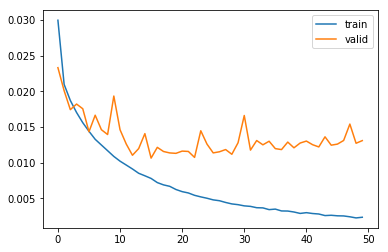
    - resnet18と34でほとんど実行時間に差がなかった。


### 20200815(Sat)
- nb015
  - nb012で作ったSpectrogramEventRmsDataSet の挙動がおかしかったので、デバッグしてみた。
  - 原因は、 `silent = ~any(event_mask)` が意図しない動作だったことが原因のようだ。
  - SpectrogramEventRmsDatasetV2を作った。(if文の構造に手を加えた)
  - とはいえ、nb013の学習結果がものすごく悪くなる理由にはならないきがする...

- nb016
  - nb013がおかしい原因を探る。
  - Datasetに問題があることを確かめるために、nb013のSpectrogramEventRmsDataset を SpectrogramDataset に差し替えてみる
  - これで、lossがしっかりおちていれば、SpectrogramEventRmsDatasetに原因があることになる。
  - めっちゃlossが悪かった。てことは、データセットのせいじゃない！！

- project01(nb013がおかしい理由を追求する。nb016は、nb013のコピーで検証用。)
  - 手法
    - nb010は正常動作、nb013は異常動作なので、双方を比べる
  - log
    - nb016
      - get_loaders_for_trainer 内の data_class を SpectrogramDatasetでベタ書きしてみた。(nb010とそろえる)
        - ---> 異常動作
    - nb010
      - 以前は正常動作だったが、何か環境の変化で異常動作を起こすかもしれないので、もう一度動かしてみる
        - ---> 正常動作
    - vimdiffを使って、nb016とnb010を比較してみる
      - nb016で、モデルの定義が2回行なわれていた。学習に使われてる方が、異常動作を起こすバグになってた。
      - ↑具体的には `model.fc = nn.Linear(in_features=513, out_features=len(BIRD_CODE))` が原因。`in_features=512`が正しい。

- nb016
  - project01で見つけたバグを修正し、もう一度実行
  - これで動いたら、nb013の異常動作が解決されたことになる。
  - 正常動作になった！

- nb017
  - nb015のSpectrogramEventRmsDatasetV2を高速化するための準備。
  - 事前にEventの時間を取得しておく。
  - 分解して計測した結果、SpectrograDasetとSpectrogramEventRmsDasetの速度差は以下の部分が原因のようだった。
    ```python
      rms = self.df_rms.query('filename == @basename').librosa_rms.values
    ```
  - 対策
    - 以下のようなデータフレームを作成
    - カラムは２つ、filenameとevent_sec_list
    - filenameには重複がない。(df_rmsに比べて遥かに小さいデータフレームになる)
    - event_sec_list には1行に [0.2, 1.2, 1.3...] のように複数のevent時間が入ったリストを用意する。

- nb018
  - SpectrogramEventRmsDatasetV3
  - nb015で作ったデータセット(SpectrogramEventRmsDatasetV2) を高速に改良する
  - V2より4倍強早くなった！！

- nb019
  - nb018で作成したSpectrogramEventRmsDatasetV3 を使用して resnet18モデルを作成する。
  - nb010と比較する。
    - nb010の違いはデータセット
    - SpectrogramDataset を SpectrogramEventRmsDatasetV3 に変更する。
  - result
    - time: 11h 10m
    - nb010 より良くなってる!!
      |nb019(SED)|nb010|
      |---|---|
      |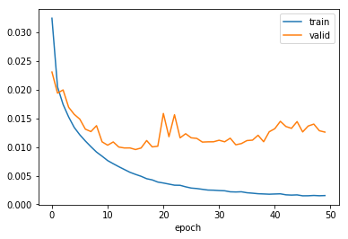||

- memo
  - [ディスカッション](https://www.kaggle.com/c/birdsong-recognition/discussion/158908): 音データのdata augmentationについて書かれている。
  - [アライさん](https://www.kaggle.com/c/birdsong-recognition/discussion/170821#951101)はSpecAugmentとmixup効かなかったんだって。
  - ↑のディスカッションで[SpecMix](http://dcase.community/documents/challenge2019/technical_reports/DCASE2019_Bouteillon_27_t2.pdf)は効くという話もあった。

  - [birdnet](https://www.kaggle.com/c/birdsong-recognition/discussion/169538#960900)使えばラベル付できるの？

### 20200815(Sun)
SpectrogramEventRmsDatasetV4 を作成。1sec で動かせるようにする。
1secモデルを作成する(debugモードで、50epochすぐ回るようにする(train_pathを減らせばいい)。early stopping を実装。)
kernelで動作確認する
nocall データセット作成する

- kagglenb08
  - nb019で作ったモデルを提出(しなかった)
  - どうせスコアよくないのわかってたからやめた。

- nb020
  - nb019を改良
    - earlystoppingを実装
    - best stateでモデルを保存
    - resnet18 --> resnet50
    - result:
      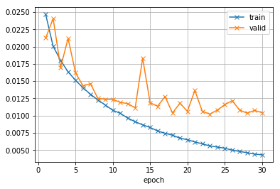
       

- nb021
  - SpectrogramEventRmsDatasetV4 を作成。1sec で動かせるようにする。
  - まずはdf_event(nb012) が 1sec でもしっかり動作してるか確認する。
  - 境界問題をスリムにした。
  - 完成！ 音聞いたけど、いい感じだった！

- nb022
  - nb020の改良
  - SpectrogramEventRmsDatasetV4(nb021)を使用する
  - 1秒の推論を行なうモデル
  - resnet50を使用
  - result
      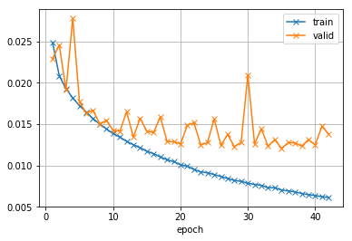

- memo
  - やっぱ[カエル先生](https://www.kaggle.com/c/birdsong-recognition/discussion/171247#954409)はtrainデータに5secごとのラベルを振ったみたいだな。
  - アライさんの[SEDノートブック](https://www.kaggle.com/hidehisaarai1213/introduction-to-sound-event-detection/data?scriptVersionId=40372870): ノイズは除いていない見たい。


- kagglenb09
  - nb020で作ったモデル(resnet50)を提出。
  - threshold = 0.8
  - result
    - score: 0.560
    - pubLB: 506/805    <----- クソみたいなスコアだけど、とりあえずベスト

- kagglenb10
  - アライさんの[SEDノートブック](https://www.kaggle.com/hidehisaarai1213/introduction-to-sound-event-detection/data?scriptVersionId=40372870)をフォーク。
  - DatasetをPANNsDatasetMod に差し替えてみた。
  - event_rms を使用している。
  - result
    - score: 0.544 (すべてnocallになってた)
    - ディスカッションに[理由](https://www.kaggle.com/hidehisaarai1213/introduction-to-sound-event-detection/data#963392)あった。すべ
    てnocallだったのは、モデルがない---> samplesubが提出される。ということが原因だったっぽい。
    - 自分でモデルちゃんと作らないとね...反省。


### 20200817(Mon)
- kagglenb11
  - kagglenb10のPANNsDatasetMod を PANNsDataset に差し替え。
  - kagglenb10の学習がうまくいってなかったので、もとのままではどうなのか確認する目的。
  - kagglenb10はうまくいってなかったわけじゃなかった(logのスコア比較)


- kagglenb12
  - kagglenb09(score: 0.56)のthresholdを0.8-->0.6にする。
  - result
    - score: 0.557  <---下がっとるやん


### 20200818(Tue)
- nb023
  - hard label を作成する
  - nb017で作成したevnt_rms データフレームを使用する。
  - train wav それぞれに5secのラベルを付与する
  - wavファイルの数(birdごと)
    - 最大100(100が多い)
    - 最小9
  - result
    - 失敗に終わった
    - 以下3つの例で説明する
      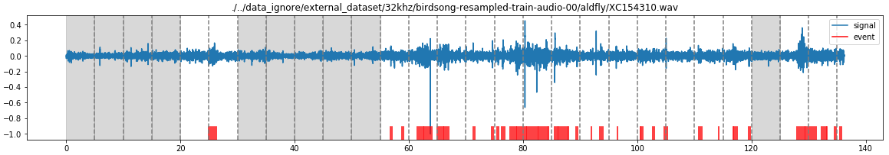  

      --> 失敗例
      --> 灰色の部分の音を聞くと鳴き声が含まれている
      <br>

      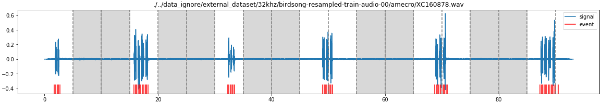  

      --> 成功例
      --> これは、非常にうまく言っている例
      <br>

      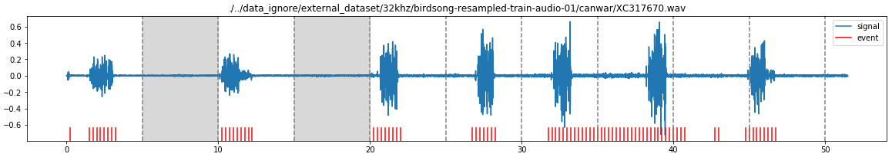

      --> 失敗例
      --> 1つ前の例と非常に類似していてうまくいっているようにも見える。  
      --> しかし実際には灰色領域にも小さいが鳥の鳴き声が聞こえている。

    - event_rms データフレームのまとめ。

      |actual \ predict|call|nocall|
      |---|---|---|
      |call|high|**<font color='red'>high</font>**|
      |nocall|low|low|

      表でまとめてみた。  
      event_rmsデータフレームがcall(event)と判断したものが、実際にcallである場合は非常に多かった。(これまでの使い方に問題はなかった)  
      今回の試みは、nocall部分を抽出することであったがこれに失敗した。  
      event_rmsデータフレームが、nocallだと判断した部分には、多くのcallが含まれていた。
      - event_rmsデータフレームは使えない？
        - --> No！ 
        - これまでと同じような使いかたなら問題ない。
      - 簡単に言うと
        - **call だと抽出された部分は信用してもいい(未検知はあるが、過検知は少ない。 high precision)**
        - **nocall だと抽出された部分を信用してはいけない(過検知がひどい。 low recall)**

 ### 20200819
- 音響イベントと音響シーンの違い曖昧だったから、この[PDF](chrome-extension://nacjakoppgmdcpemlfnfegmlhipddanj/https://www.jstage.jst.go.jp/article/jasj/74/4/74_198/_pdf)読んでよかった。

- nb024
  - [アライさんのSEDの入門ノートブック](https://www.kaggle.com/hidehisaarai1213/introduction-to-sound-event-detection)をローカルで動かしてみる。
  - pretrained model は[こちら](https://zenodo.org/record/3987831#.Xzu9GXVfjS8)から
  - BCELoss でnanが出る。エラーの原因が正直わからない。
    - nanが出たら、early_stopping が走らないようにした

- nb025
  - nb024の改良
  - PANNsDataset-->PANNsEventRmsDatasetにした。
  - result
    - 共通のF1スコア設けてないからいいのか悪いのかわからん！   <---- バカ！！！！！！
      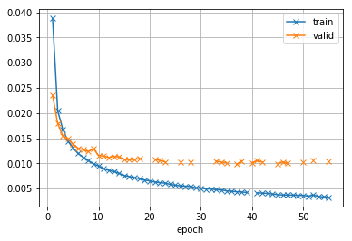
    


### 20200820
- kagglenb13
  - nb024 のやつ提出しようとしたけど、どうせスコア悪いからやめた。

- kagglenb14
  - nb025 のモデルデータで学習した
  - score: 0.481  <---- スコアかなり悪いな... なにがよくなかったんだろう...

- nb026
  - resnestを実装
  - [tawaraさんのノートブック](https://www.kaggle.com/ttahara/training-birdsong-baseline-resnest50-fast)を真似してみただけ。
      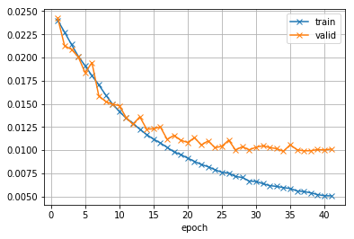

- nb027
  - nb026の改良
  - resnest
  - SpectralDataset を SpectrogramEventRmsDatasetV3に変更
  - result
      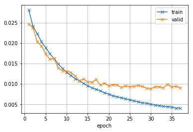

    

- memo
  - SEDのSOTAな手法をまとめてくれてる[discussion](https://www.kaggle.com/c/birdsong-recognition/discussion/175027)
  - DeepLearning & audio の[youtube解説](https://www.youtube.com/playlist?list=PLhA3b2k8R3t2Ng1WW_7MiXeh1pfQJQi_P)
  - [カエル先生のディスカッション](https://www.kaggle.com/c/birdsong-recognition/discussion/174187)。距離の影響について話ししている。
  - アライさんのfeaturemap aggregationについての[ディスカッション](https://www.kaggle.com/c/birdsong-recognition/discussion/167611)

### 20200821
- kagglenb14
  - nb027のモデルを提出
  - resnest
  - SpectrogramEventRmsDatasetV3
  - threshold = 0.8
  - result
    - score: 0.554

- kagglenb15
  - nb026のモデルを提出
  - resnest
  - SpectrogramDataset
  - threshold = 0.6
  - result
    - score: 0.556
    - おかしい。tawaraさんのノートブックを真似しただけのはずだが...
      - 違いと言えば、batch sizeぐらいだと思う...

### 20200822
issue#93をやる

- nb028
  - nb026のbatch_size を変えて、tawaraさんと同じ状況にしてみるだけ。
  - [tawaraさんのノートブック](https://www.kaggle.com/ttahara/training-birdsong-baseline-resnest50-fast)を真似してみただけ。
  - result
      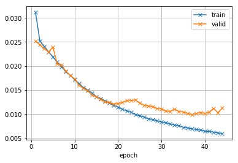
    - 学習はうまくいっているように見える
      
    - birdcall-checkが結構違う...
  - prediction のコードが間違っているのかを確認するために以下の手順を踏んだ
    - tawara さんが学習したモデルをダウンロード
    - nb028のprediction loop にダウンロードしたモデルを使ってみる
    - result
      ---> 　[tawaraさんの公開ノートブック](https://www.kaggle.com/ttahara/inference-birdsong-baseline-resnest50-fast/data?select=best_model.pth)の結果と同じものが出力された。  
      --->  ということは、学習のコードに問題があることになる...
  


- memo
  - test_sample から nocall のデータを抽出した[discussion](https://www.kaggle.com/c/birdsong-recognition/discussion/176368)を見つけた。あとで確認する。[issue](https://github.com/fkubota/kaggle-Cornell-Birdcall-Identification/projects/1#card-44109140)化済み。

- nb029
  - stratifiedKfoldのパラメータがまったく同じなのにも関わらず、出てくる値がまったく違うということが起こっていた。
  - scikit-learnのバージョンの違いが原因のようだ....
    - scikit-learn==0.23.1にすると、一致した...
    - train と valid に使われるデータ数に差があったのが原因だったの？
  - result
    - まだtawaraさんの結果とはちょっと違う
    - でもこれたぶん、pytorchのバージョンとかのせいだと思うから、あまり気にしないでおこう。  
  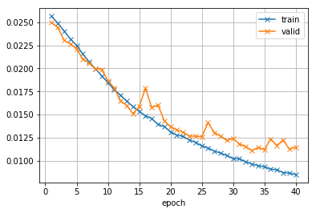


- [issue#93](https://github.com/fkubota/kaggle-Cornell-Birdcall-Identification/issues/93)  
  - 解決！！
  - [mindmap](https://drive.mindmup.com/map/1DgCOa0mNgTx8Ji1EvrlWPD5mExDj4Upq)
    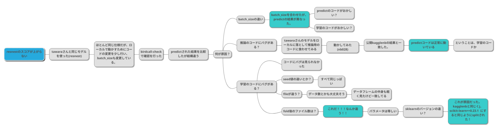


### 20200823
- nb030
  - nb029を改良
  - SpectrogramDataset を SpectrogramEventRmsDatasetに変更した
  - result   
    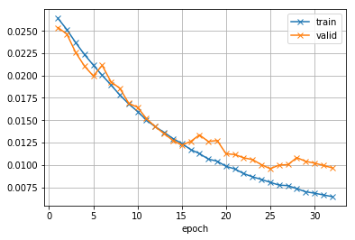

    - birdcall-checkのpredictはtawaraさんのpredictとやっぱちょっと違う。
    - まだ何か違うのかな...


- nb031
  - nb030の結果が思ったのと違ったので、もう少し調査する。
  - train_loader, valid_loaderの中身も見たけど一致している。
  - SpectrogramDataset の np.random.choice の値も一致していた。

- nb032
  - tawaraさんのモデルと、nb029とnb030で作ったモデルのpredictを確認する。
  - confusion matrix書いてみた。


|tawara|nb029|nb030|
|---|---|---|
|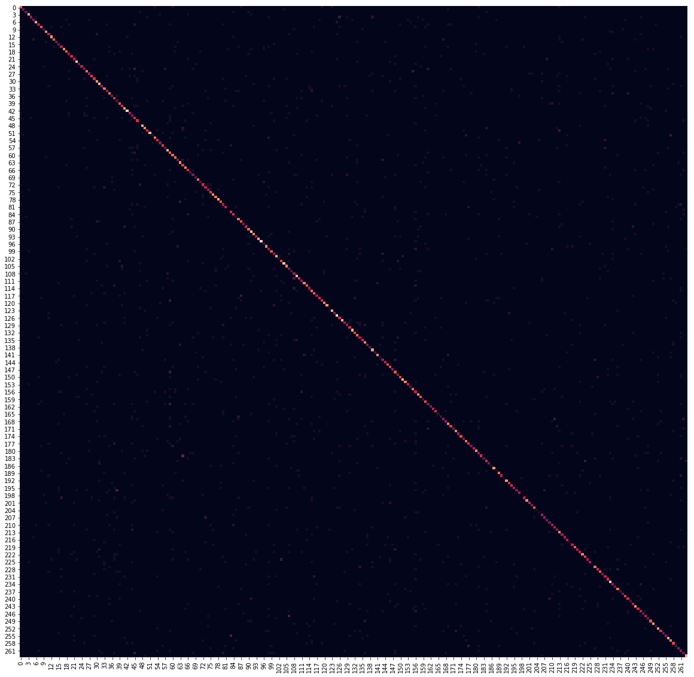|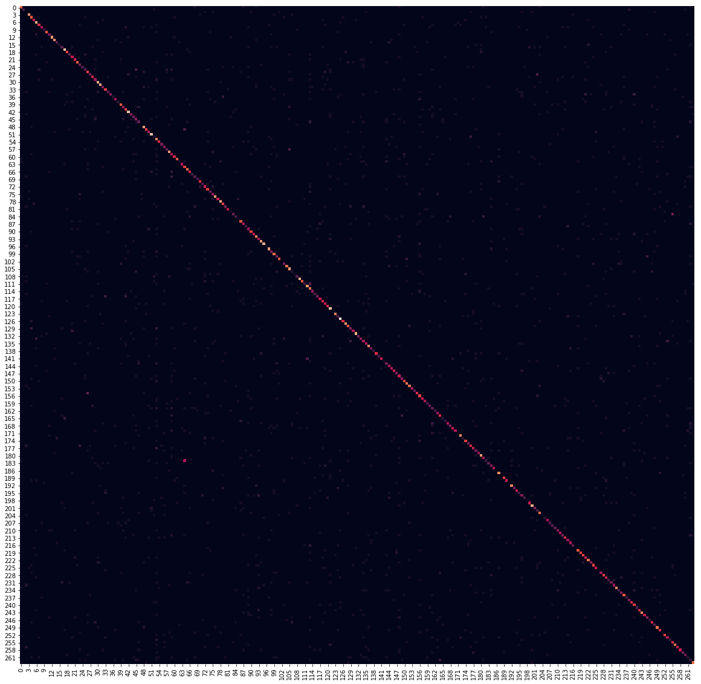|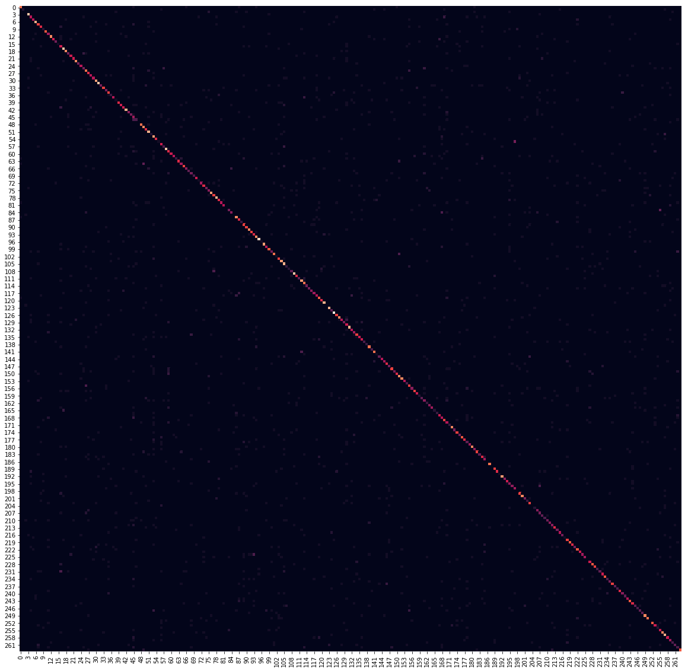|


- kagglenb16
  - nb030のモデルを提出
  - thre = 0.6
  - result
    - score: 0.562   <---- best!!


### 20200824
- kagglenb17
  - nb030のモデルを提出
  - thre0.8
  - result
    - score: 0.560

- [ヒントクダサーイって言ってるdiscussion](https://www.kaggle.com/c/birdsong-recognition/discussion/176959)。少しの工夫で、0.675出たよって人がいるな...
  - アーキテクチャとか変更せずに、学習の方法と推論の方法を工夫すると、0.575いったってさ。([url](https://www.kaggle.com/c/birdsong-recognition/discussion/176959#983419))
- [SEDがなんでいいの？って質問してるdiscussion](https://www.kaggle.com/c/birdsong-recognition/discussion/176490)。アライさんが返信していて、なんか参考になりそうな予感。
  - SEDで作ったモデルを使って、強いラベルを作ることができるけど、それをどう使うのだろうか。
- [freesound コンペの7th solution](https://www.kaggle.com/c/freesound-audio-tagging-2019/discussion/97812)。アライさんたちのチームのソリューション。

### 20200825

# single CNNで絶対いいスコアとる！！！！！
## アーキテクチャとか変更せずに、学習の方法と推論の方法を工夫すると、0.575いったってさ。([url](https://www.kaggle.com/c/birdsong-recognition/discussion/176959#983419))

- もう一度、[tarawaさんの、training notebook](https://www.kaggle.com/ttahara/training-birdsong-baseline-resnest50-fast)を見てみた。コメントとかを重点的に。

- **<font color='red'>重要</font>** [url](https://www.kaggle.com/ttahara/training-birdsong-baseline-resnest50-fast#940009): tawaraさんのノートブックでのschedulerの更新位置がおかしかったことが報告されている。

- [nocall モデルを作成したノートブック](https://www.kaggle.com/takamichitoda/birdcall-nocall-prediction-by-panns-inference)

- nb033  <---- :::::::::::::::::::: 転回点 :::::::::::::::::::::::::
  - nb029の改良
  - schedulerの更新箇所がおかしかったので修正した。
  - result
    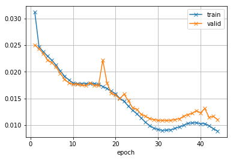

### 20200826
- freesound 7th solution(アライさんチーム)を読んだ。
  - めっちゃ参考になる情報がたくさんあった。
  - augmentation
  - Strength Adaptive Crop
  - Custom CNN

### 20200827
- nb034
  - freesound 7th solutionにあったStrength Adaptive Crop を試してみた。
  - 思ったような操作をしてくれなかった。背景ノイズに大きな影響を受ける...
  - 代わりに、500~16000HzのIntensityをつかってみる。
  - 手法
    - spectrogramを計算
    - 時刻tにおけるスペクトルを500~16000hzの範囲で積算しこれをintensityとする。
    - noise = med(intensity)を計算することにより、ノイズの大きさを見積もる。
    - signal(t)/noise > 2 の部分をevent部分とする

    |example1|example2|
    |---|---|
    |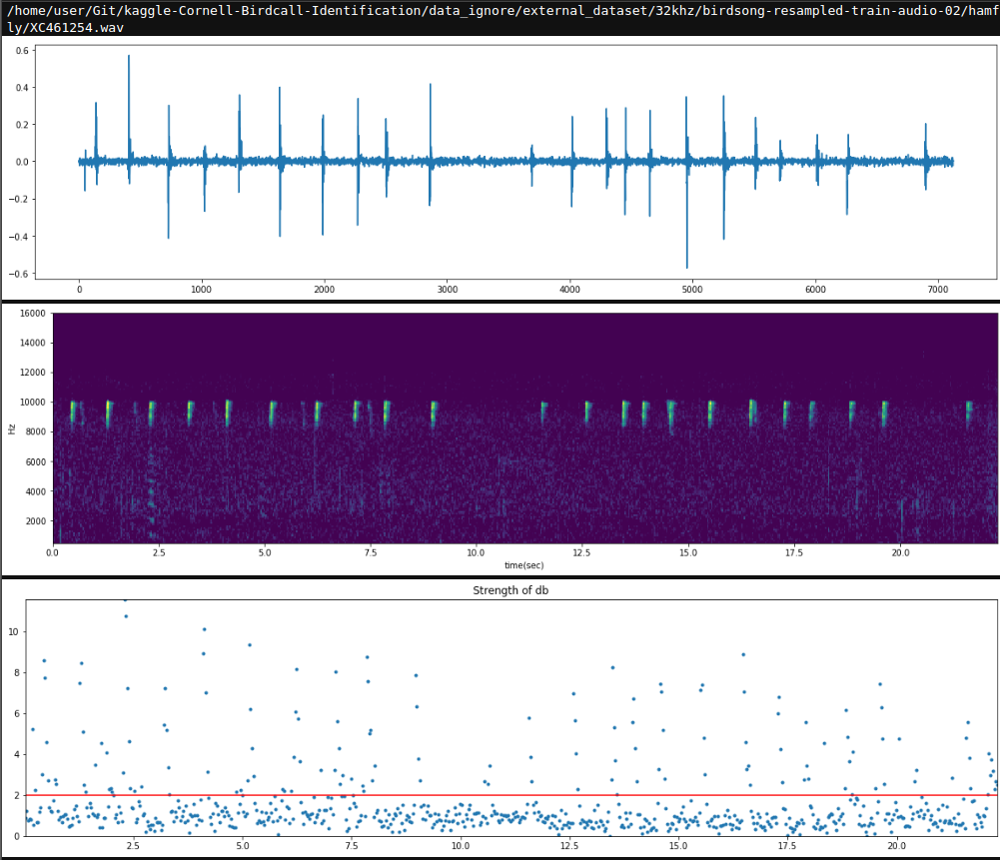|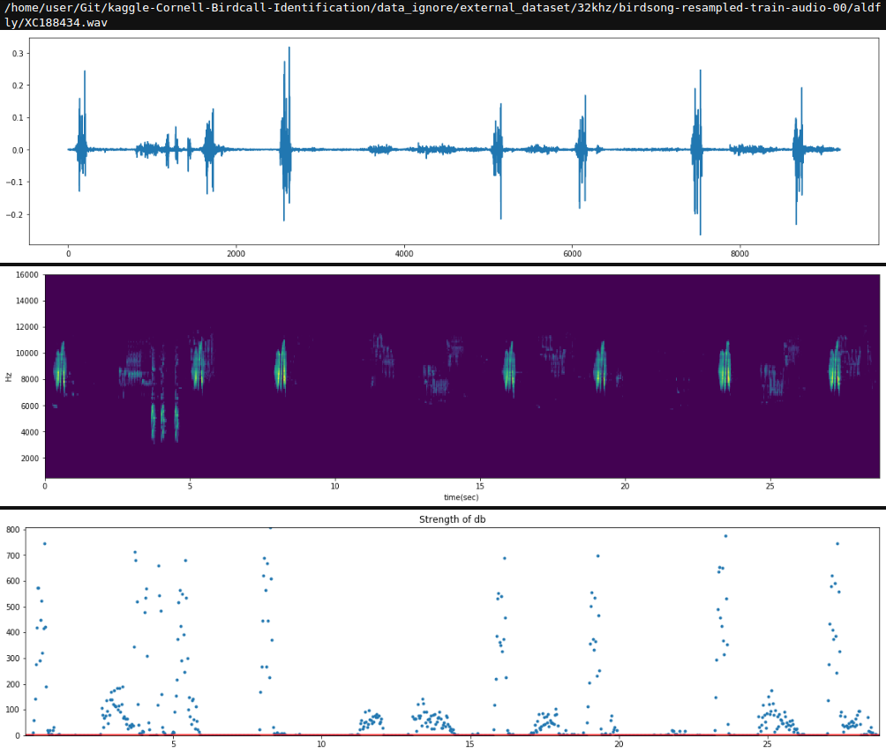|

- nb035
  - nb033の改良
  - paper03に記載されていた鳥の鳴き声の周波数帯域(0.5~1.2kHz)の情報を取り入れた。
  - result
    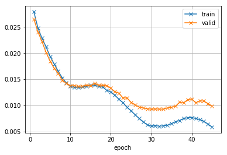
- kagglenb18
  - nb033を提出
  - result
    - score: 0.557
    - びみょーーーー

- kagglenb19
  - nb035を提出
  - resnest
  - 500~12000Hzのみ使用した
  - result
    - score: 0.505  <--- は？？？？むっちゃ低いやん。絶対おかしいって。

- nb036
 - nb034で作ったeventを使ってDatasetを作成する

### 20200827
- nb037
  - nb035の改良
  - 0.5~1.2kHz ---> 0.5~1.6kHzを使う
    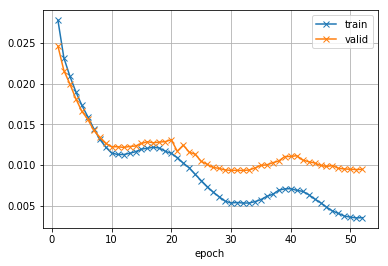

- nb038
  - nb033の改良
  - nb036で作成したSpectrogramEventIntensity500to16000hzを使用する
    


### 20200828
- kagglenb20
  - nb037を提出
  - resnest
  - 500~16000Hzのみを使用した
  - result
    - score: 0.548  <--- 絶対おかしいし
  

- kagglenb21
  - nb038を提出
  - resnest
  - SpectrogramEventIntensity500to16000hz
  - result
    - score: 0.523


- nb039
  - nb025にfscore入れて計算   <---------------------- ::::::::::::::::: これやらな


### 20200829
kaggglenb21の結果が悪いことの考察

- [tawaraさんのノートブック](https://www.kaggle.com/ttahara/training-birdsong-baseline-resnest50-fast)で使われていた `mono_to_color` の正規化に問題があると指摘している[ディスカッション](https://www.kaggle.com/ttahara/training-birdsong-baseline-resnest50-fast)。
  - そこまでクリティカルに効いてくる問題ではないだろうから、今はあと回し。


### 20200830
- 午前中はdiscussionを死ぬほど眺めていた。
  - [このディスカッション](https://www.kaggle.com/c/birdsong-recognition/discussion/176959)が今の自分には勉強になった
    - テーマは、0.568を超えるにはどうしたらいいですか？というもの。
    - この[コメント](https://www.kaggle.com/c/birdsong-recognition/discussion/176959#983419)が大変印象的で、tawaraさんのノートブックの学習と推論部分を少し変更するだけで、0.575いったみたい(tawara notebook score: 0.568)。
    - tawaraさんのコードに疑いを持たずに、それに足し算をするようなことやっていたけど、もう少し吟味しよう。
    - [disukelabさんのコメント](https://www.kaggle.com/c/birdsong-recognition/discussion/176959#984246): site3の部分を工夫するといいよとのこと。確かに、ここ改良の余地あるな。
    - [このコメント](https://www.kaggle.com/c/birdsong-recognition/discussion/176959#985150)では、snrが効かなかったと言ってる。効いた例も見たとは言ってるので必須ではなさそうだ。


- kagglenb22
  - kagglenb16(score: 0.562)を改良
  - site3のperdictがうまく言ってるか確認する
  - site3を適当なクラス('foxspa': 100)にしてみる
  - result
    - score: 0.561  <--- 全然スコア下がってない...てことは、site3は全く機能していないの？


- nb040
  - site3のinference部分を解析してみる。
  - たしかめたいこと
    - 1clipに対して多くのbirdsが割り当てられてないか？
    - nocallになっているものが多くないか？
  - 考えていること
    - 1clipにあまりに多くのbirdsは含まれないはず(5個以上はないだろう)
    - site3にそもそもnocallがあっていいのだろうか？
  - result
    - いつも使ってる提出用の推論用コード使ったら、10%ぐらいnocallだった。
    - 以下のような提出用推論用コード(predicttion_site3_mod)作った。(site3を書き換えた。)
      - 1file(1clip) 全体でargmaxを計算して、top1の1classを提出する。
      - これには、pros, consが存在する。
        - pros: nocall がなくなる
        - cons: 多数のクラス出力ができない


- kagglenb23
  - nb030で作ったモデルを使う
  - kagglenb16の改良
  - nb040で作った、prediction_site3_modを使用してみる。
  - site3でnocallを出さない&clip(5secより大きい範囲で)全体でargmaxをとる工夫を入れた。
  - site3の複数クラス出力が不可能となるデメリットがある。
  - result
    - score: 0.562


### 20200831
#### **<font color='red'>root4kaidoさんとチームマージ</font>** した日

- [site3の後処理を工夫しているディスカッション](https://www.kaggle.com/kneroma/resnest50-fast-too-much-birds-could-hurt/comments?select=submission.csv)
  - ランキングを使用している。

- kaggnenb24
  - kaggnenb16(0.562)の改良
  - site3の出力をすべてnocallにしてみた。
  - result
    - score: 0.561


- kagglenb25_fork_tawara_nocall
  - tawaraさんの推論ノートブックを編集。site3をすべてnocallにしてみる。
  - result
    - score: 0.567
    - LB: 419/1150


- **<font color='blue'> ここまでのsite3 predictionについてmindmapでまとめた。</font>**
  - [mindmap](https://drive.mindmup.com/map/1T96se7COR-xxFEpT1SCUus_pxI4Xc9P2)
  
  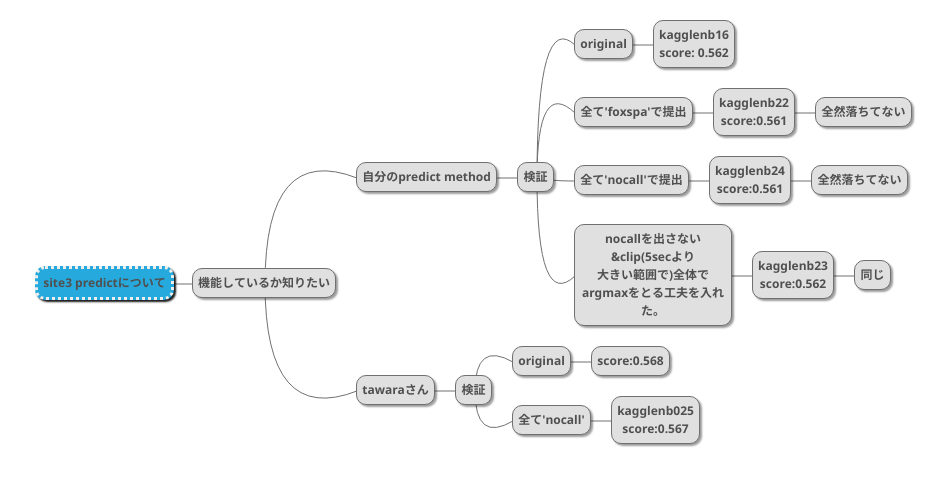

    - ---> comment: あーこれ、あれだ。site3のデータが少ないんだ。それだけか。descriptionのdata にも書いてある。
    - ---> site3(recording time) > site1+site2(recording time) だとしても5secで分割するので、site1+site2(file数) > site3(ファイル数) になるのか。


### 20200901
これ読んだほうがよさそう: https://www.kaggle.com/c/birdsong-recognition/discussion/160222#895234


- hydraのカスタムディレクトリを使ってみた。(https://github.com/fkubota/playground_hydra_custom_dir)
- pipeline作成に参考にするリポジトリ
  - [araiさん、birdcall](https://github.com/koukyo1994/kaggle-birdcall-resnet-baseline-training)
  - [araiさん、tabuler pipeline](https://github.com/koukyo1994/tabular-data-analysis-pipeline)


### 20200902
- 今日もパイプライン作っていく
  - ほとんどアライさんの真似

- hydraが解決している問題を紹介した[記事](https://medium.com/pytorch/hydra-a-fresh-look-at-configuration-for-machine-learning-projects-50583186b710)を見つけた。すごくいい。


### 20200903
- 今日でパイプライン完成させる！！
- [1chについてのディスカッション](https://www.kaggle.com/c/birdsong-recognition/discussion/179547)
- [augmentationについてのディスカッション](https://www.kaggle.com/c/birdsong-recognition/discussion/178917): どれが効いたのかを議論している。
- 度々出てくるpytorchのエラーは、[このissue](https://github.com/fkubota/kaggle-Cornell-Birdcall-Identification/issues/54)で対応している。

- pipelineのベータ版完成
  - hydraを使用
  - 結果をcsvをで吐く機能を実装
  - ログを吐く機能を実装
  - すべての結果を集約する機能を実装

### 20200904
- pipelineにResNeStを追加

- hydra 18-50-44
  - 画像サイズを変更してみる
  - base: resnet50_v1
  - try0
    - img_size=224
  - try1
    - img_size=112
  - result(f1_macro)
    - img_size=224: 0.476575
    - img_size=112: 0.280828
    - img_size=224 の方がよさそう

- hydra 21-47-32
  - fold依存を確認
  - base: resnest_v1
  - try0
    - fold=0
  - try1
    - fold=1
  - result(f1_macro)
    - try0: 0.351661
    - try1: 0.238392
    - 結構依存してるな...

### 20200905
- hydra 12-52-34
  - lr を 0.001-->0.01にした
  - result(f1_macro)
    - try0: 0.000035
    - くっそ低いな...

### 20200906
- hydra 19-56-52 
  - baseline of pipeline
  - resnest
  - hold依存を確認する
  - result
    - try0
      - f1_macro: 0.634128
    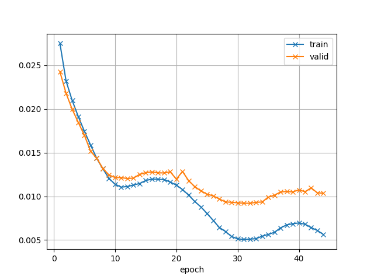
    - try2
      - missってやってない

- root4kaidoさんのトライ
  - original
    - 2secでモデルを作成
    - 精度は悪かった
    - 2secの範囲に、鳥の鳴き声が入っていない可能性がある
  - try1
    - event part
    - 改善されず
  - try2
    - event part + random crop でやってみた 


- nb042
  - class imbalancedに対応する
  - 1classあたりのファイル数。
  - 最大は100, 最小は9
  - 下のグラフはファイル数が少ないものを並べた
      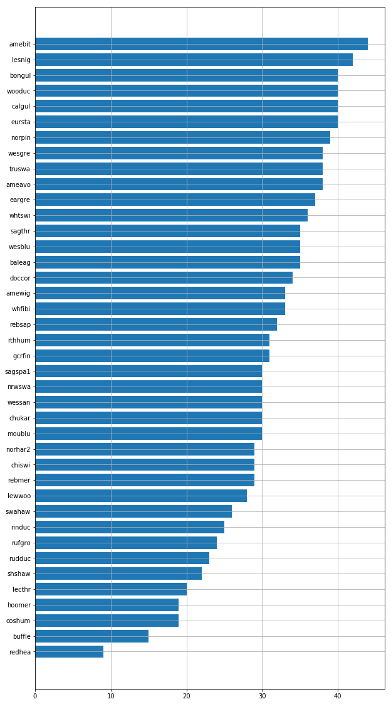

### 20200907
- 昨日回した、hydra 19-56-52だけど、foldsを0, 1にしたはずなのに、うまくhydraに反映されてなかった。
  - 原因わかった。
  - globals.comment=resnest,hogehoge みたいなオプション渡していたので、そのmalutirunが走っていたんだ...
- hydra 00-37-59
  - class imbalanced に対処
  - nb042の手法を使用
  - result
    - f1_macro: 0.694686  (いまのとこベスト)
    - 注意: train と valid に分ける前にfileを重複有りで水増ししている。splitの仕方によっては、trainとvalidそれぞれに同じデータが入っている可能性がある。random crop でかぶる確率は低いだろうが。
      

- hydra 08-18-23
  - fold-1で走らせる
  - 20200906_19-56-52のfold0と比較して、fold依存を確認する
  - result
    - f1_macro: 0.609316
  - 考察

  |run|val_loss|f1_macro|fold|
  |---|---|---|---|
  |2020-09-06/19-56-52/try0|0.009203|0.634128|0|
  |2020-09-07/08-18-23/try0|0.009492|0.609316|1|

  ---> 結構fold依存ありますねー


- kagglenb26
  - hydra20200906-195652のモデル
  - pipelineのベースライン(baseline)
  - result
    - LB: 0.563

- kagglenb27
  - hydra20200907-003759 を提出
  - class imbalanced に対処
  - result
    - score: 0.566

- nb043
  - SpectrogramEventRandomDatasetを作成

- hydra 19-34-xx
  - imbaranced に対処
  - EventRandomDataset (from nb042) を追加
  - try0
    - ratio = 0.5

  - try1
    - ratio = 0.1


- nb044
  - SpectrogramMultiRandomDatasetを作成
  - random_cropをn_random 回実行して、足し算する

- hydra 22-20-54
  - nb044で作成した SpectogramMultiRandomDataset を使用する
  - class balanced
  - try0
    - n_random=5
  - try1
    - n_random=10
    - 途中で止めた


### 20200907

- kagglenb28(baseline- LB: 0.563, f1_macro: 0.634)
  - hydra 19-34-07
  - class blanced
  - event + random_crop
  - result
    - LB_score: 0.553
    - f1_macro: 0.636

- kagglenb29(baseline- LB: 0.563, f1_macro: 0.634)
  - hydra 22-20-47
  - class balanced
  - multi random
  - result
    - LB_score: 0.560
    - f1_macro: 0.545


- nb045
  - validation dataset に対しても水増しを行ってしまっていたので、純粋なvalidationだけで評価してみる
    - 対象のモデル
      - hydra 20200907_19-34-07
      - hydra 20200907_22-20-47


### 20200908
- hydra 23-17-08
  - class balanced
  - balancedは、trainだけにやった。
  - result
    - f1_macro: 0.636227
    

- root4kaido さんと現状をまとめた
  - 2secモデルはあきらめる
  - balanced はいける   <--- 後々の議論でだめだとわかった
  - event + random_crop はだめ
  - multi_random_crop もだめ

    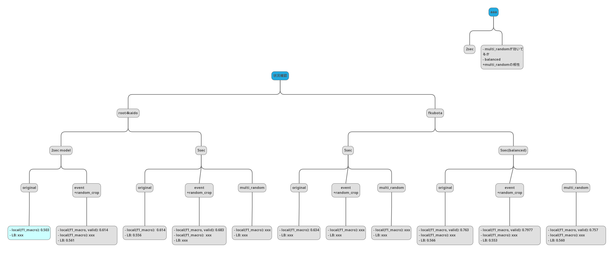


### 20200909
- 朝はアイデア出しした--> root4kaidoさんに提示して方向性の決定
  - (後回し)(大)site3だけthresholdを下げる
  - (僕)(中)5sec以下のデータを学習データから外す
  - (2人)(小)cutmix, mixupのコードがシェアされていた(https://www.kaggle.com/c/birdsong-recognition/discussion/181162)
  - (僕)(中)baseとbalancedのsigmoid 出力を比較してみる。thresholdの決め手になるかも？
  - (root4kaido)(急)second labelがあるやつの出力をみてみる。
  - (覚書) threshold devil discussion では、threshold=0.5がいいといっている。(freesoundとか？)(犬猫問題、PANNsのやつがつかえる？)
  - (後回し)(小)model.fc を疑ってみる。
  - (root4kaido)(中) ratingが低いものを抜く


- hydra 05-22-33
  - event + random_crop (ratio of event=0.5)
  - class balanced
  - balanced はtrain だけにやった
  - result
    - f1_macro: 0.6306
    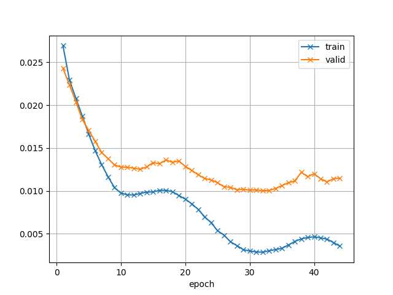

- hydra 05-29-29
  - multi ramdom (n_random=5)
  - class balanced
  - valid balanced はtrain だけにやった
  - result
    - f1_macro: 0.54519
    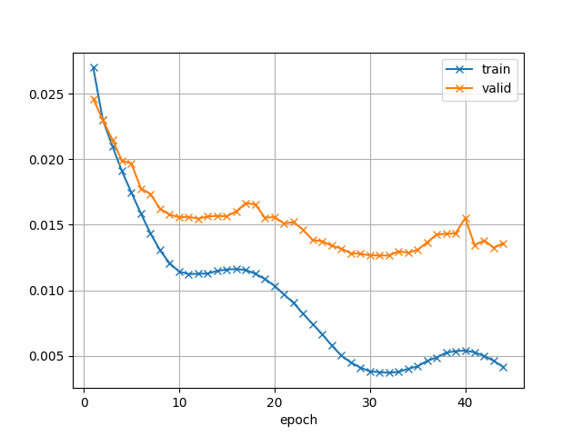


- 5sec未満のデータの割合: 5.249 %
  - 結構あるので、対処してもいいかも

- hydra 22-57-25(baseline: 0.634128)
  - multi random
  - not class balanced
  - n_random=2
  - result
    - f1_macro: 0.617374


- hydra 23-39-25(baseline: 0.634128)
  - balanced
  - remove short duration
  - result
    - f1_macro: 0.648


### 20200910
- kagglenb30(baseline- LB: 0.563, f1_macro: 0.634)
  - hydra 20200909-233925
  - class balanced
  - multi random
  - result
    - LB_score: 0.549
    - f1_macro: 0.648

- kagglenb31(baseline LB: 0.563, f1_macro: 0.634)
  - hydra 20200908-231708
  - class balanced
  - result
    - LB_score: 0.531
    - f1_macro: 0.636

- hydra 16-53-33(baseline f1_macro: 0.634128)
  - not balanced
  - remove short duration 5sec
  - result
    - f1_macro: 0.616719

- **<font color='red'> 新しいアイデア</font>**: 5secのスペクトログラムにマスクをかける。
  - 例) masksize = 2 sec, stride = 1 sec
    1. maskされていない部分は 0~2sec でその他はmaskをかけて0とする。
    2. maskされていない部分は 1~3sec でその他はmaskをかけて0とする。
    3. 以下同様


- kagglenb33
  - hydra20200906_19565のモデルを使用
  - stride mask inference の性能を確かめる試み
  - nocall_check を使って、過剰に検出していないかを見る

### 20200911
- nb046
  - stride mask inference の性能を確かめたい
  - secondary label を使う

    


- kagglenb32
  - hydra20200906_195652(baseline)
  - stride mask inference
  - params
    - thre = 0.8
    - mask_num = 3
  - result:
    - score: 0.554

- kagglenb34
  - hydra20200906_19565
  - params
    - thre = 0.6
    - mask_num = 2
  - result
    - score: 0.537

### 20200912(Sat)
- kagglenb35
  - hydra20200906_19565
  - params
    - thre = 0.9
    - mask_num = 3
  - result
    - score: 0.560

- nb047
  - nb046を改良。スッキリさせる。
  - prediction_for_clip_stride_mask_modを作成
    - tawara inference + stride_mask の組み合わせ
    - tawara inferenceがnocallじゃないものを吐いた時だけ、stride_maskが動くようにした。
    - stride_mask がnocallに弱い傾向があるための処置。
    - tawara inference より、stride_mask が効いているのかのテストになる。
  - secondary label があるデータとebird_codeを合わせたラベルを作成し、sample_wiseで評価を行った。
  - 例: threshold: 0.8)
    - 下の画像の通り、stride_maskの方がスコアが高い場合が多い

    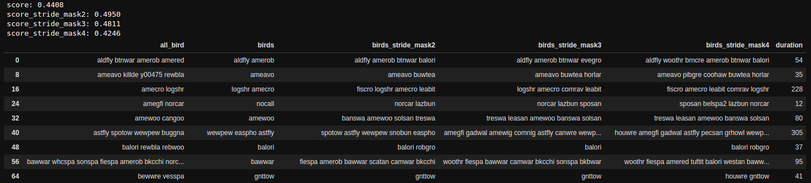

### 20200913(Sun)
- kagglenb36
  - hydra20200906-195652(baseline)
  - stride mask inference を使用する
  - mask_num = 3
  - threshold = 0.85
  - result
    - score: 0.557

- nb048  
  - stride mask inference を評価したい
  - 評価するフレームワークの作成
  - データを4種類に分けた
    - nocall dataset
    - site3
    - 1bird
    - some birds

  - result
    - threshold, mask_num にかなり敏感

    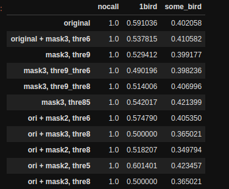

- nb049
  - nocallデータセットの作成
  - [ff1010 のデータセット](http://machine-listening.eecs.qmul.ac.uk/bird-audio-detection-challenge/)から一部のデータを抜き出す
  - 出力先: ```./../data/external_dataset/ff1010bird_selection/wav_32000/```

- nb050
  - ff1010 dataset をnocallデータセットとして、評価を行なう
  - 3種類のデータセットでスコアを計算した
    - nocall, 1bird, some birds
  - 計算式
  - ```score = 0.544*nocall*nocall_reduction + ((1-0.544)*(1-some_bird_ratio))*_1bird + ((1-0.544)*some_bird_ratio)*some_bird```
  - 上式のnocall_reductionとsomebird_ratioを最適化で決定した。
  - ```(各モデルのLB_score - 各モデルのスコア)**2``` の総和が最も小さくなるように最適化。

    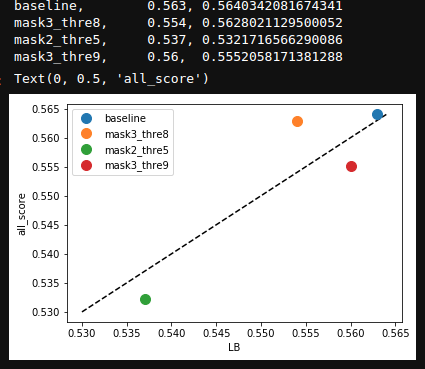

  - パラメータが決まったので、最もスコアの高いモデル、thresholdを決定する。
    - best_nocall_reductioin 0.6700000000000002
    - best_some_bird 0.34
  - result:

    

    ---> この解析だと、mask_num=2, threshold=0.8が良いみたい。予想では、0.573のスコアが出るみたい。本当かよ。

### 20200914(Mon)
- kagglenb37
  - hydra20200906_19565
  - nb050の結果を元に、パラメータを変更。予想では、0.573のスコアが出る。
  - mask_num = 2 
  - threshold = 0.8
  - result
    - score: 0.554
    - 下がりましたねはい。　

- nb051
  - ff1010 dataset をnocallデータセットとして、評価を行なう
  - 3種類のデータセットでスコアを計算した
    - nocall, 1bird, some birds

    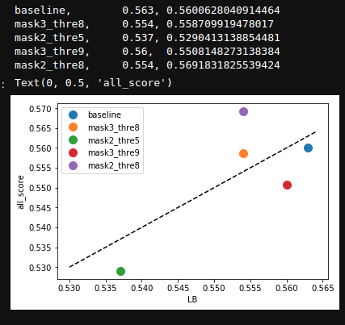

    ---> 再現あまりできてない...


  - result
    - best_nocall_reductioin 0.660
    - best_some_bird 0.33

    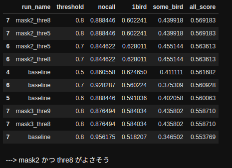

- nb052
  - ff1010データセットがnocallデータセットとして、微妙だと感じたので新しいデータセットを探した。
  - [このデータセット](https://www.kaggle.com/luisblanche/birdcall-background)をnocallとして使う。
  - 300KB未満のデータを除いて保存した。

- kagglenb38
  - hydra20200914_154416
  - baselineを10foldにした
  - threshold = 0.6
  - result
    - score: 0.560

### 20200915(Tue)
#### ::: 最終日 :::
- kagglenb39
  - hydra20200914_154416
  - baselineを10foldにした
  - threshold = 0.8
  - result
    - score: 0.560

- kagglenb40
  - ensemble
    - 10fold_usefold0: 20200914-154416
    - 10fold_usefold3: 20200914-235041
    - 5fold_usefold0_balanced: 20200907-003759
  - threshold = 0.6
  - result: 
    - score: 0.566


- kagglenb41
  - ensemble
    - 10fold_usefold0: 20200914-154416
    - 10fold_usefold3: 20200914-235041
    - 5fold_usefold0_balanced: 20200907-003759
  - threshold = 0.5
  - result: 
    - score: 0.566


## Winner Solution
- [summary](https://www.kaggle.com/c/birdsong-recognition/discussion/183998)

|Rank(prv(pub))|Detail|URL|
|---|---|---|
|1(7)|ソリューションの大部分はアライさんのSEDがもとになってる。外部データは使わず、4パターンの水増し(Pink noise, gaussian noise, gaussian snr, Gain)を使った。←gainて意味あんの？？。モデルはdensenetに変更。lossは改造したもの？よくわからん。ensembleはvoting。4票以上入ればその鳥が存在するとしたようだ。ここのモデルはそれほどスコアがよくなかったがアンサンブルでスコアブーストした。|[url](https://www.kaggle.com/c/birdsong-recognition/discussion/183208)|
|2(3)|publicでアライさんとずっと競ってた人。コントリビュータなのにすごいと思ってた。spectrogramを保存していた。ハンドラベリングしまくった。現実の世界では、距離が遠いと高周波数帯が減衰するので、0.5の確率で減衰させた。255番目のクラスとして、nocallを入れたがあまりスコアが上がらなかった。大きなネットワークは小さなネットワークより僅かに悪くなった。疑似ラベルはスコアを下げる方向になった。|[url](https://www.kaggle.com/c/birdsong-recognition/discussion/183269)|
|3(4)|ソリューションには、データの拡張、モデリング、後処理という3つの主要な側面がある。水増しはtrainとtestデータの性質の違いを埋める重要な役割がある。S/N比0.5でgauussianノイズ入れる。バックグラウンドノイズもいれる(鳥が鳴いていないデータ。ソースはいろいろ。)。modified mixupをつかった(よくわかってない)。ランダムクロップの代わりにoofの予測確率を使った。←これいいな。外部データを使用した方がいい。信頼できるvalidationは持っていなかった。validationのときはファイルの最初の5secを用いた。後処理については、[こちら](https://www.kaggle.com/kneroma/the-power-of-postprocessing-resnest50-at-its-best)。|[url](https://www.kaggle.com/c/birdsong-recognition/discussion/183269)|
|4(6)|xeno-cantの外部拡張データセットを使った。スペクトログラムの差分(delta)が効いたみたい。secondary_labelを学習に使った。validationにはいくつかのスコアを用いている(discussion見て)。earlystoppingには、mAPを使ったようだ。EfficientNets (B3, B4, B5)を使った。data augmentationはめっちゃ効いた。バックグラウンドノイズデータセットを作成した。exsample test audioには、低周波数が含まれてなかったのでカットした。|[url](https://www.kaggle.com/c/birdsong-recognition/discussion/183339)|
|5(5)|ドメインシフトとclipwise to framewiseの遷移にうまく対処したかった。snrおよびnocallの分布に関して、ターゲットの分布にできるだけ近い検証/テストセットが必要だった。validationセットでは、nocallの比率を変化させたセットを用意した。nocallを新しいクラスとしてみたが機能しなかった。trust LB。トランジットの問題？あるので、水増しはあまり効かないが多くの時間を費やしてしまった。<---でも最終サブには水増しいれてるらしい。Clipwise-->Framewiseについて。5sec cropの時、secondary labelとnocallの扱いが難しい。これには、label のsmoothingが効いた。clipwise to framewiseの話がおもしろい。これはディスカッションで見たほうがいい。|[url](https://www.kaggle.com/c/birdsong-recognition/discussion/183300)|


## 鳥コンペ反省会
|著者|Ref|
|---|---|
|trtd|[url](https://docs.google.com/presentation/d/1E7fcFxzmHFAypB3ToyxhjW8IjKKRehzDjffIFD5TUW0/edit#slide=id.p)|
|ymicky06|[url](https://docs.google.com/presentation/d/1QAcl5dMW_d-J3B8AEidv737ELGq8yo9g2wOanMGL83M/edit#slide=id.p)|
|fkubota|[url](https://speakerdeck.com/fkubota/niao-konpedecan-bai-sitahua-tokonpefalsequ-rizu-mifang)|
|enu_kuro|[url](https://zenn.dev/enu_kuro/articles/d8ff124a232c576756c4)|
|nino_pira|[url](https://docs.google.com/presentation/d/e/2PACX-1vS70DWBHs8Vurd_CoqwUSWN4V2BLUJjSh2QEwd9ehWe_F3z78iRwHawpV6bAXbUuRrHZVTeEcwIl4XK/pub?start=false&loop=false&delayms=3000&slide=id.p)|
|arai|[url](https://speakerdeck.com/koukyo1994/niao-konpefan-sheng-hui-zi-liao)|